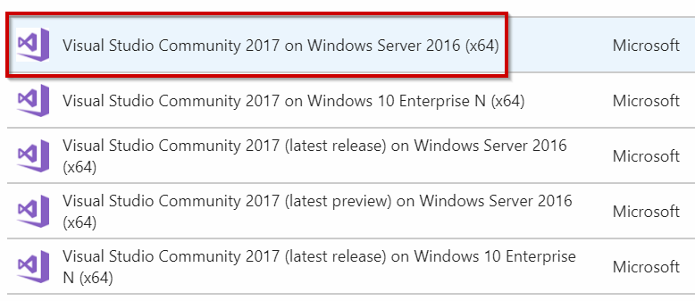
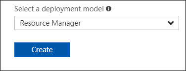
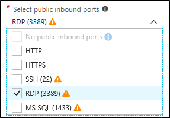
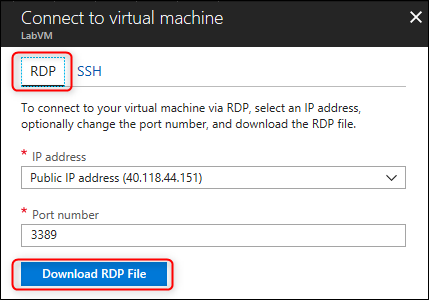
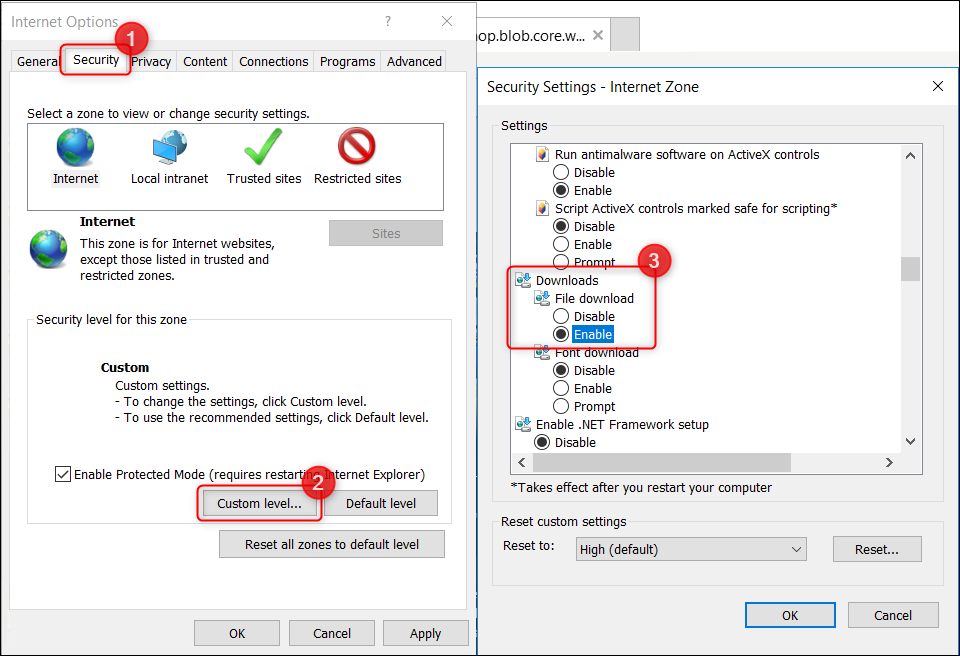
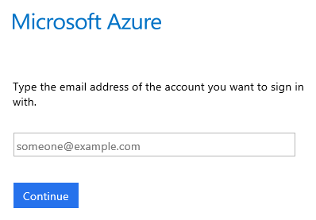

Azure security and management

Before the hands-on lab setup guide

September 2018

Information in this document, including URL and other Internet Web site references, is subject to change without notice. Unless otherwise noted, the example companies, organizations, products, domain names, e-mail addresses, logos, people, places, and events depicted herein are fictitious, and no association with any real company, organization, product, domain name, e-mail address, logo, person, place or event is intended or should be inferred. Complying with all applicable copyright laws is the responsibility of the user. Without limiting the rights under copyright, no part of this document may be reproduced, stored in or introduced into a retrieval system, or transmitted in any form or by any means (electronic, mechanical, photocopying, recording, or otherwise), or for any purpose, without the express written permission of Microsoft Corporation.

Microsoft may have patents, patent applications, trademarks, copyrights, or other intellectual property rights covering subject matter in this document. Except as expressly provided in any written license agreement from Microsoft, the furnishing of this document does not give you any license to these patents, trademarks, copyrights, or other intellectual property.

The names of manufacturers, products, or URLs are provided for informational purposes only and Microsoft makes no representations and warranties, either expressed, implied, or statutory, regarding these manufacturers or the use of the products with any Microsoft technologies. The inclusion of a manufacturer or product does not imply endorsement of Microsoft of the manufacturer or product. Links may be provided to third party sites. Such sites are not under the control of Microsoft and Microsoft is not responsible for the contents of any linked site or any link contained in a linked site, or any changes or updates to such sites. Microsoft is not responsible for webcasting or any other form of transmission received from any linked site. Microsoft is providing these links to you only as a convenience, and the inclusion of any link does not imply endorsement of Microsoft of the site or the products contained therein.

© 2018 Microsoft Corporation. All rights reserved.

Microsoft and the trademarks listed at <https://www.microsoft.com/en-us/legal/intellectualproperty/Trademarks/Usage/General.aspx> are trademarks of the Microsoft group of companies. All other trademarks are property of their respective owners.

**Contents**

<!-- TOC -->

- [Azure Security and Management before the hands-on lab setup guide](#azure-security-and-management-before-the-hands-on-lab-setup-guide)
    - [Requirements](#requirements)
    - [Before the hands-on lab](#before-the-hands-on-lab)
        - [Task 1: Build a lab Virtual Machine in Azure.](#task-1-build-a-lab-virtual-machine-in-azure)
        - [Task 2: Connect to LABVM and download and unzip student files](#task-2-connect-to-labvm-download-and-unzip-student-files)
        - [Task 3: Create a new Azure portal dashboard](#task-3-create-a-new-azure-portal-dashboard)

<!-- /TOC -->

# Azure Security and Management before the hands-on lab setup guide

## Requirements

-   A corporate e-mail address (*e.g.*, your \@microsoft.com email).

-   Microsoft Azure subscription must be pay-as-you-go or MSDN

    -   Trial subscriptions will *not* work.

-   Local machine or an Azure LABVM virtual machine configured with:

    -   Visual Studio 2017 Community Edition or later

    -   Azure SDK 2.9.+ or Later for Visual Studio

    -   Azure PowerShell 4.0 or later

## Before the hands-on lab

Duration: 30 mins

Before attending the HOL, you should follow these steps to prepare your environment for an efficient day. Your first task will be to build a **LABVM** to use for the HOL and download some student files that will be used. Then, you will create a new Azure Dashboard to use during the HOL.

### Task 1: Build a lab Virtual Machine in Azure

1.  Launch a browser and navigate to <https://portal.azure.com>. Once prompted, login with your Microsoft Azure credentials. If prompted, choose whether your account is an organization account or just a Microsoft Account.

    >**Note**: You may need to launch an \"in-private\" session in your browser if you have multiple Microsoft Accounts.

2.  Select **+Create a resource**, and in the search box, type in **Visual Studio Community 2017,** and press enter. Select the Visual Studio Community 2017 image running on Windows Server 2016.

    

3.  Leave the default of *Resource Manager* deployment model and select **Create**.

    

4.  Set the following configuration on the Basics tab and select **OK**:

    -   Name: **LABVM**

    -   VM disk type: **SSD**

    -   User name: **demouser**

    -   Password: **demo\@pass123**

    -   Subscription: **If you have multiple subscriptions, choose the subscription to execute your labs in**.

    -   Resource Group: **OPSLABRG**

    -   Location: **Choose the closest Azure region to you**.

    

5.  Choose the **DS2\_V2 or D2S\_V3 Standard** instance size on the Size blade. Use the 'Search' filter to help find the size you need.

    

6.  On the Settings blade, open the **Select public inbound ports** drop-down (if shown) and select **RDP**.
    
    

7.  Leave the other settings at their default values, and select **OK**, then choose **Create** on the Summary blade. The deployment should begin provisioning. It may take 10+ minutes for the virtual machine to complete provisioning.

    

8.  Once the deployment is complete, move on to the next exercise.

### Task 2: Connect to LABVM and download and unzip student files

1.  Move back to the Portal page on your local machine and wait for **LABVM** to show the Status of **Running**. Once it is running, select **Connect** to open the 'Connect to virtual machine' blade.

    

2.  On the **RDP** tab, select **Download RDP File**.

    

3.  Login with the credentials specified during creation:

    a.  User: **demouser**

    b.  Password: **demo\@pass123**

4.  You will be presented with a Remote Desktop Connection warning because of a certificate trust issue. Select **Yes** to continue with the connection.

    

5.  When logging on for the first time, you will see a prompt on the right asking about network discovery. Select **No**.

    

6.  Server Manager should open by default (otherwise open it from the Start menu). On the left, select **Local Server**.

    

7.  On the right side of the pane, find **IE Enhanced Security Configuration**. If it is **On**, select to open the settings.

    

8.  Change to **Off** for Administrators and select **OK**.

    

9.  In the lower left corner, click on the **Windows** button to open the **Start Screen**. Then, choose **Internet Explorer** to open it. On first use, you will be prompted about security settings. Accept the defaults by selecting **OK**.

    

10. If prompted, choose to Turn Protected mode on.

    

11. In the URL address window enter the below URL and hit the Enter key. This will download the class files (in a .zip format) needed for the remaining labs: <https://cloudworkshop.blob.core.windows.net/operations-management-suite/StudentFiles.zip>.

    >**Note**: In some Azure VM images, the image is configured so that downloads are disabled. To enable the download of the Student Files, go to Internet Options, select the Security Tab, and on the Internet Zone select \"Custom Level\". Then scroll down to the Downloads section and select the radio button for Enable in the File Download subsection.

    

12. You will be prompted about what you want to do with the file. Select **Save**.

    

13. Download progress is shown at the bottom of the browser window. When the download is complete, select **Open folder**.

14. The **Downloads** folder opens. ***Right-click*** the zip file and select **Extract All**. In the **Extract Compressed (Zipped) Folders** window, enter **C:\\HOL** in the **Select a Destination and Extract Files** dialog. select the **Extract** button.

### Task 3: Create a new Azure portal dashboard

1.  Open Internet Explorer on LABVM and point to <https://portal.azure.com>.

2.  Sign in to Azure using your credentials.

    

3.  Once you are at the Azure Portal Dashboard select **New Dashboard,** and type the name **My Dashboard,** then select **done customizing**.

    

    

4.  Then navigate to your **LABVM** blade and use the "**Pin**" to add it to **My Dashboard**. This Dashboard will be used for the rest of this HOL.

    

5.  If you're going to be finishing this lab today, then continue to the next exercise. Otherwise, if you won't be finishing the rest of the lab today, then it may be helpful to select **Stop** on your **LABVM** within the Azure Portal. This will put the VM into a Stopped / Deallocated state and save money until it's needed again. When you're ready to continue with the lab, then navigate back to the **LABVM** blade and select **Start** to start it back up again.

You should follow all steps provided *before* attending the Hands-on lab.
